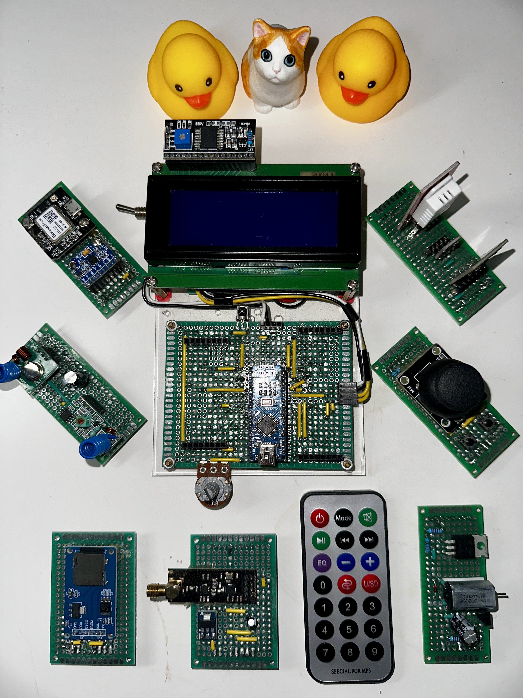
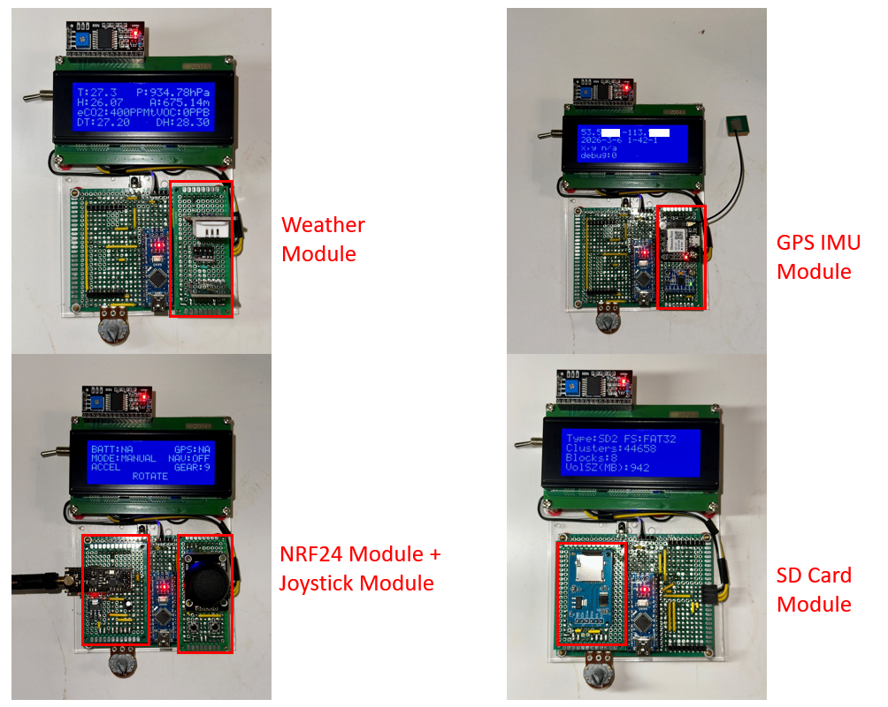

# BananaKit2

🍌 **BananaKit2** is a custom designed MPU development platform based on Arduino
Nano.

The goal of this project is to bridge the gap between **ideas and rapid prototyping**,
making development faster and keeping hardware/software modules organized for reuse.

In traditional Arduino/MCU prototyping, circuits are usually built on a breadboard
while firmware is developed in parallel. Once the project is finished, the circuit
is often dismantled and the code is forgotten.

BananaKit2 proposes a different workflow:

1. Design a circuit blueprint

2. Build the module on a small prototype PCB

3. Develop a reusable software module

4. Store both hardware and software modules permanently in one place

When you start a new project, you can simply plug in previously built modules and
enable their software components.

No rewiring.

No rewriting code.



## Function Demo

To see how it works, the following examples demonstrate BananaKit2 running
different modules without rewiring hardware or changing firmware.

Simply plug in the hardware modules and use the IR remote controller to switch
between functions.

Plug Weather Module, start weather program;

Plug GPS Module, start GPS program;

Plug Joystick Module and NRF24 Module, control an RC car;

Plug SD Card Module, read data from an SD card.



## Get Started

1. Install the Arduino IDE on your system.

2. Clone this repository into your Arduino libraries directory:

Linux

```
~/Arduino/libraries/
```

Windows

```
Documents\Arduino\libraries\
```

3. Enable or disable modules in:

```
src/bananakit.h
```

Example:

```
#define ENABLE_JOYSTICK_MODULE
```

4. Open the example project:

```
examples/BananaKit2/BananaKit2.ino
```

5. Build and upload the firmware to BananaKit2.

### Using the Interface

After powering on BananaKit2, the LCD will display the **Main Menu**.

Use the IR remote buttons:

| Button | Function            |
| ------ | ------------------- |
| 2      | Move up             |
| 5      | Move down           |
| 6      | Start module        |
| 4      | Return to main menu |

## Build BananaKit2 Hardware

Unfortunately, you cannot buy BananaKit2 at this time and you have to build one
for youself if you are interested and if you know how to use soldering iron.

Checkout [Hardware List](doc/hardware_list.md) for detailed purchase list.

After purchase all required components, follow the
[Assembly Instruction](doc/assembly_instruction.md) to build your BananaKit2.

## Advanced

### Build Custom Module

BananaKit2 supports two types of standard prototype PCB sizes:

| Module Size  | Use Case                        |
| ------------ | ------------------------------- |
| **3 × 7 cm** | Analog sensors and I2C devices  |
| **4 × 6 cm** | Digital modules and SPI devices |

Each module uses **two 8-pin male connectors**.

### 3×7cm Module Pins

* I2C
* UART
* D3–D6
* A1–A5
* A7

### 4×6cm Module Pins

* SPI
* D3–D6
* D8
* D9

Both module types receive **5V power** and can be used simultaneously.


### Develop Module Software

To create a BananaKit2-compatible software module:

To develop custom software module compatable with BananaKit2, you need to change
the following parts in the repository:

1. Edit `src/bananakit.h` to register IO pins:

```c
#define NRF24_CE_PIN        10
#define NRF24_CSN_PIN       9
#define NRF24_IRQ_PIN       3
```

2. Edit `src/bananakit.h` to add a module enable macro:

```c
#define ENABLE_JOYSTICK_MODULE
```

3. Include the module in the example firmware `examples/BananaKit2/BananaKit2.ino`:

```c
#ifdef ENABLE_RADIO_MODULE
#include "module/radio_module.h"
#endif
```

4. Register the module in the main menu in `examples/BananaKit2/BananaKit2.ino`:

Example:
```c
#ifdef ENABLE_MICROSD_MODULE
register_new_node(
    "microSD",
    microsd_module_init,
    microsd_module_update,
    microsd_module_resume,
    microsd_module_exit,
    Main_menu
);
#endif
```

5. Add your source code:

| Directory     | Purpose               |
| ------------- | --------------------- |
| `src/module/` | Module implementation |
| `src/lib/`    | Custom libraries      |

### Firmware Size Limitation

The **ATmega328P** has limited flash memory, you may encounter oversized firmware
that failed to upload if you turn on too many modules at the same time.
Try to reduce your firmware size by turning off uncessary/unused modules.

### Pinout Reference

[BananaKit2 Mainboard Pinout](doc/mainboard_blueprint.png)

[Module Pinout 3x7CM](doc/empty_module_3x7.png)

[Module Pinout 4x6CM](doc/empty_module_4x6.png)

### Supported Module Blueprints

[Weather Module Blueprint](doc/weather_module_blueprint.png)

[GPS IMU Module Blueprint](doc/gps_imu_blueprint.png)

[Radio Module Blueprint]()

[DC Motor Module Blueprint]()

[Joystick Module Blueprint]()

[NRF24 Module Blueprint](doc/nrf24_module_blueprint.png)

[MicroSD Module Blueprint]()


## Dependencies & Credits

This project uses the following open-source libraries:

[LiquidCrystal\_I2C](https://github.com/marcoschwartz/LiquidCrystal_I2C)

[Adafruit BME280 Library](https://github.com/adafruit/Adafruit_BME280_Library)

[Adafruit BNO055](https://github.com/adafruit/Adafruit_BNO055)

[IRremote](https://github.com/z3t0/Arduino-IRremote)

[MPU6050](https://github.com/electroniccats/mpu6050)

[RF24](https://nRF24.github.io/RF24/)

[SD](http://www.arduino.cc/en/Reference/SD)

[SparkFun CCS811 Arduino
Library](https://github.com/sparkfun/SparkFun_CCS811_Arduino_Library)

[Thin](https://github.com/siqiyan/thin)

[CRC](https://github.com/RobTillaart/CRC)

Please refer to their respective repositories for documentation and licenses.
