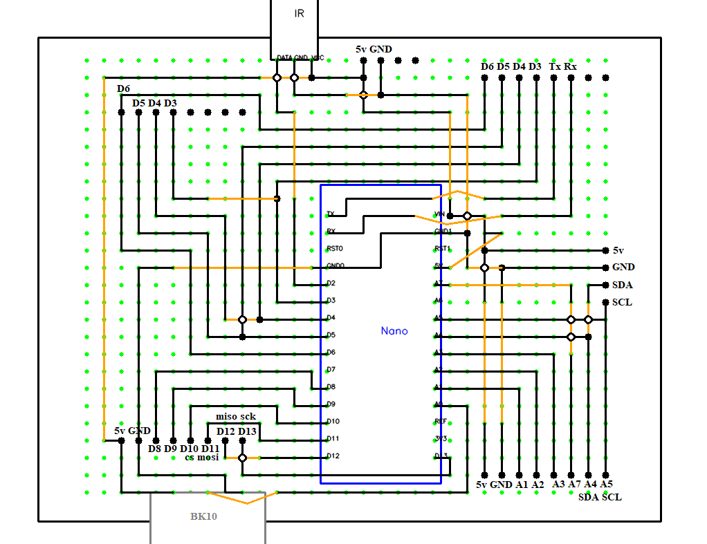
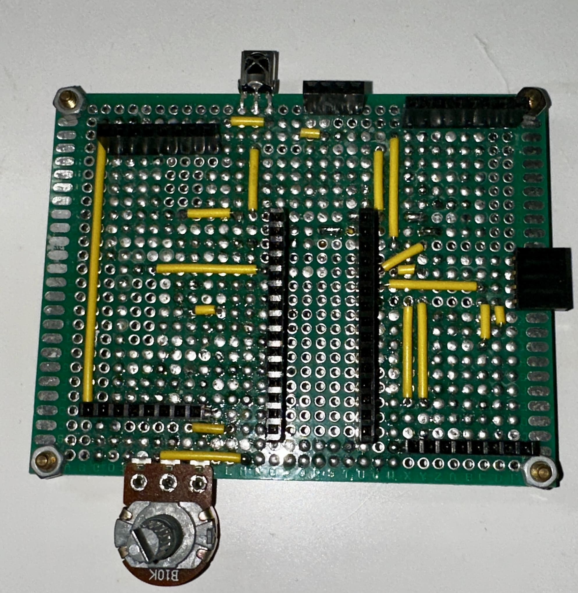
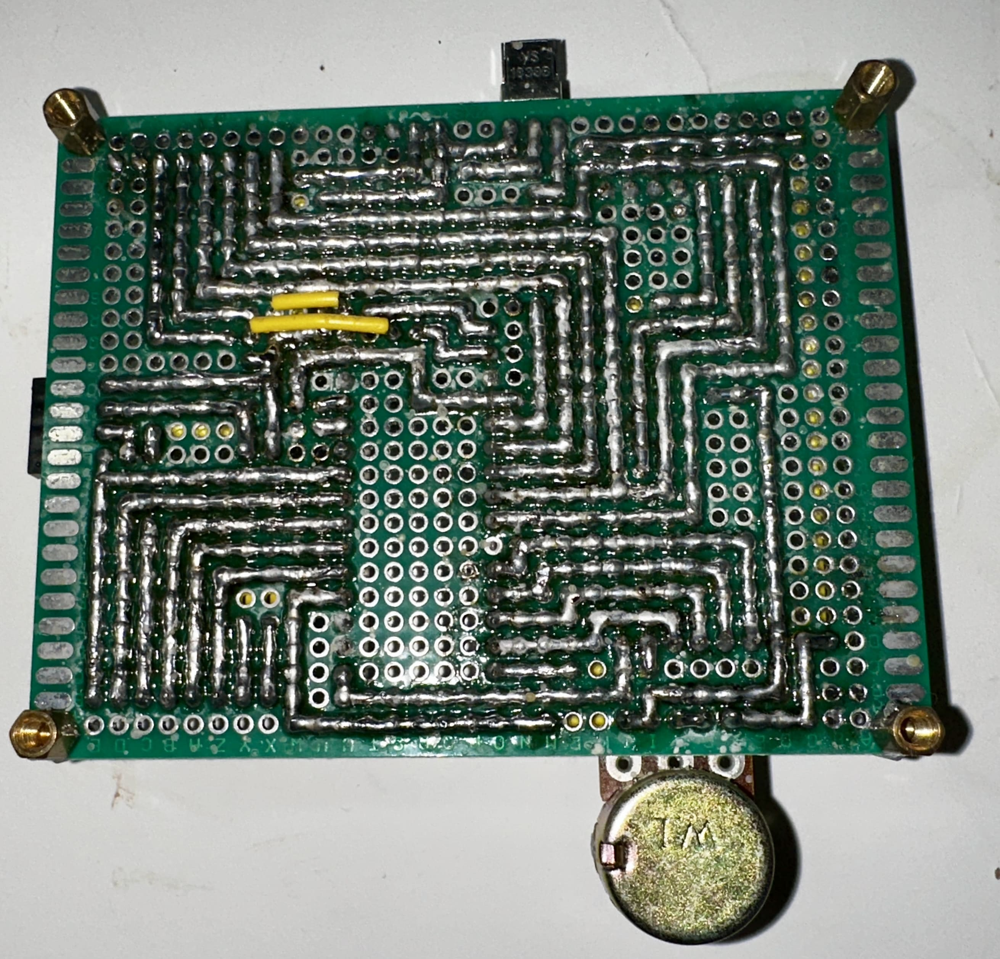
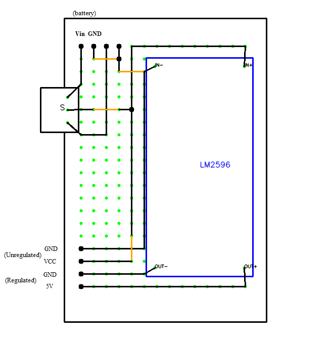
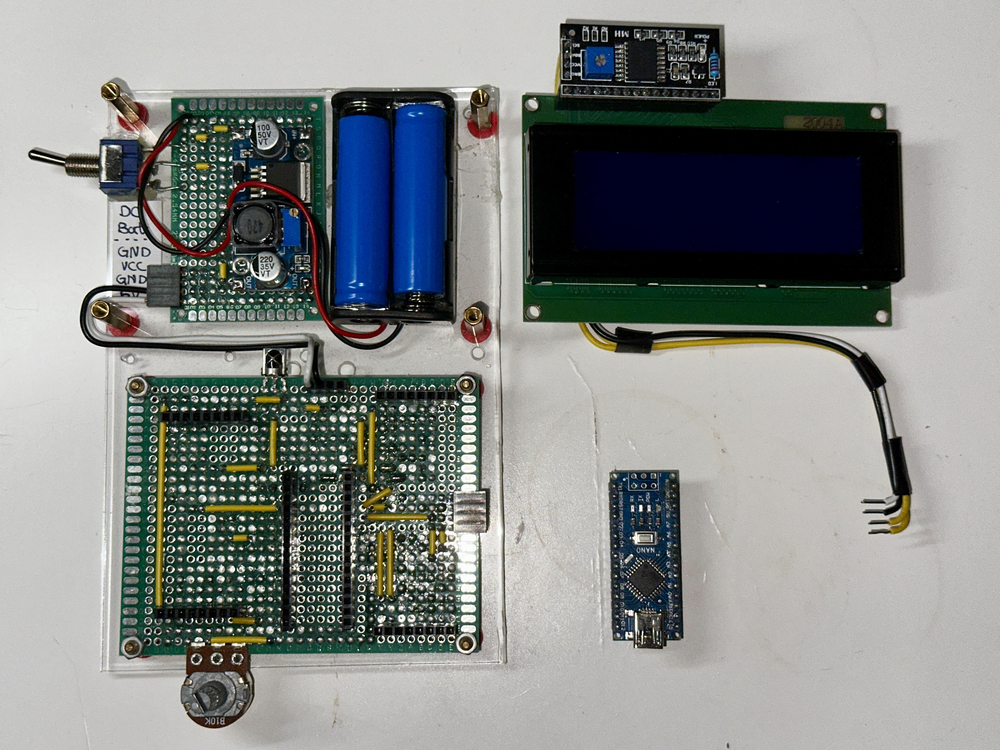

# BananaKit2 Assembly Instruction

## Step 1 Build the Mainboard

First build the Mainboard for BananaKit2. Here is the BananaKit2 Mainboard blueprint:

Building this PCB requires lot of soldering work, but when its done the mainboard will looks like this:

And the back will looks like:

## Step 2 Build the Power Supply Module

Technically you just need to supply stable 5V to the mainboard using any method, but for me
I found LM2569 and two 12400 batteries works really good. Here is how I
use LM2569 as my power supply module:

Make sure to use a multimeter to measure the output voltage on LM2569 and
adjust to 5V before powering on the system.

## Step 3 Build the LCD Screen

To save IO pins I use the PCF8574T I2C Adapter together with the 2004A LCD. See the disassembly
image below for details.

## Step 4 Wire the System Together

After you have the mainboard, power supply module and the LCD, it is time to
wire the system together. Checkout the following disassembly image for my
setup, but you can use any way as long as the wiring is correct:

You can drill holes on an acrylic sheet as a base or 3D print a case
for BananaKit2.